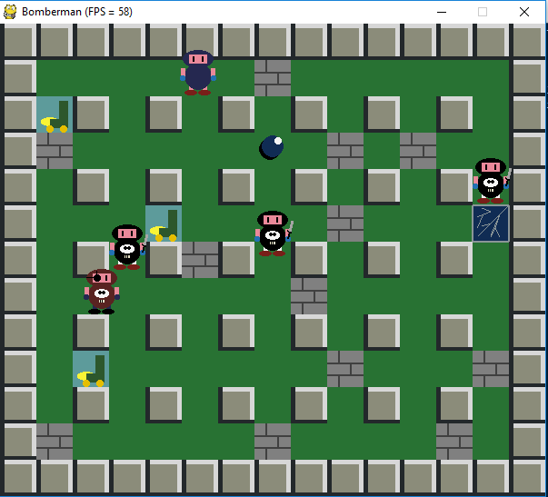
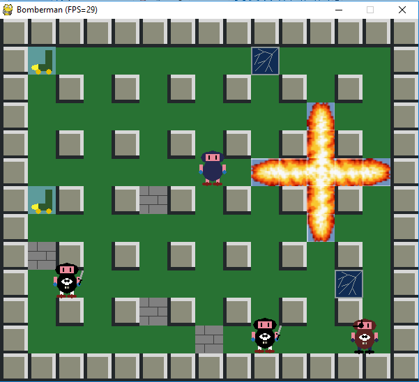

# Juego tipo Bomberman #

Proyecto destinado a cumplir con fines educativos. Corresponde a un juego tipo Bomberman desarrollado en PyGame, a partir de cierto código proporcionado por el curso de Modelación y Computación Gráfica, 2018.

## Requerimientos:
* Python 2.7.13
* PyGame
* PyOpenGL
* numpy

## Instalación

Se puede instalar via Conda para usar Python 2.

Steps:
```
conda create -n Bomberman-env python=2.7.13
conda activate Bomberman-env
pip isntall pygame
pip install pyopengl
pip install numpy
```

## Hacer correr el juego

Hay dos versinoes del juego: 
- una desarrollada en PyGame puro (usa sprites para las explosiones)
- otra en PyGame y OpenGL (con explosiones propias)

### OpenGL version:
```
cd src/
python main.py
```

### PyGame version (with sprites):
```
cd src_pygame/
python main.py
```

## Gameplay
2 tipos de poderes:
- **patines:** mayor velocidad
- **rayo:** mayor alcance de epxlosión

Se reinician por cada nivel.

Se avancza de nivel pasando por el portal que se encuentra bajo algún bloque de cemento (hay que destruirlo para encontrarlo).

Los enemigos te pueden eliminar, al igual que las explosiones de tus bombas.

### Controls:
- **a:** put bomb
- **arrow keys:** move person
- **q:** quit

## Screenshots

### Gameplay with OpenGL

Power ups and explosions in OpenGL.




### Gameply with PyGame


## Troubleshooting

Si aparece un error como este al ejecutar:
```
libGL error: failed to load driver: radeonsi
libGL error: MESA-LOADER: failed to open radeonsi:
```

Podría resolverse con la variable de entorno:
`export LD_PRELOAD=/usr/lib/x86_64-linux-gnu/libstdc++.so.6`

Como aparece en el enlace: [Issue](https://github.com/pygame/pygame/issues/3405).

## Créditos
**Author:** Cristián Llull Torres

**Contact:** cllullt@gmail.com

Código inicial y ayuda en el desarrollo:

- Pablo Pizarro R.
- Mauricio Araneda H.
- Pablo R. Polanco
- Daniel Calderón

