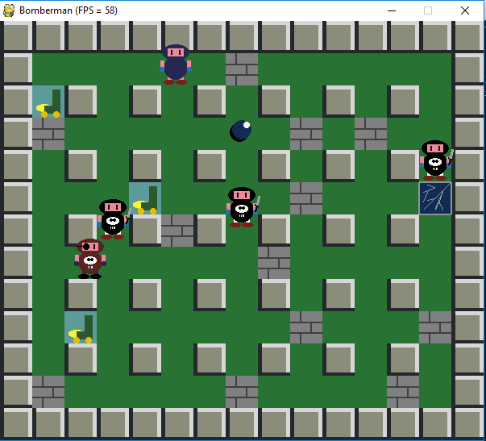
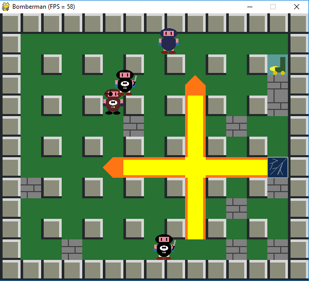

# Game like Bomberman #

Project with educational purposes. It is a Bomberman-like game developed in Python 2.7.13.

## Requirements:
* Python 2.7.13
* PyGame
* PyOpenGL
* numpy

## Installation

Can be installed via conda package as Python 2 is deprecated already.

Steps:
```
conda create -n Bomberman-env python=2.7.13
conda activate Bomberman-env
pip isntall pygame
pip install pyopengl
pip install numpy
```

## Executing

There are two versions of the game: one with pure PyGame (using sprites for the explosions) and one with PyGame and PyOpenGL (with drawn explosions).

### OpenGL version:
```
cd src/
python main.py
```

### PyGame version (with sprites):
```
cd src_pygame/
python main.py
```

## Gameplay
There are two power ups:
- roller skates: increased velocity
- lightning: increased explosion power

### Controls:
- a: put bomb
- arrow keys: move person
- q: quit

## Screenshots







## Troubleshooting

If there is an error like:
```
libGL error: failed to load driver: radeonsi
libGL error: MESA-LOADER: failed to open radeonsi:
```

It may be fixed with:
`export LD_PRELOAD=/usr/lib/x86_64-linux-gnu/libstdc++.so.6`

as stated in [Issue](https://github.com/pygame/pygame/issues/3405).

## Credits
**Author:** Cristián Llull Torres
**Contact:** cllullt@gmail.com

Help and initial code by:

- Pablo Pizarro R.
- Mauricio Araneda H.
- Pablo R. Polanco
- Daniel Calderón

